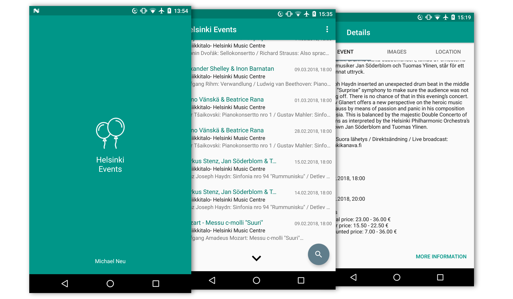

# Helsinki Events Browser

The *Helsinki Events Browser* app provides an interface to [Helsinki's linked events API](https://dev.hel.fi/projects/linked-events/). It was developped as an Android application during OTH Regensburg's course *App development for Android Smartphones*. 

## Features

To pass the course, our lecturer provided the following list of features to implement. The student's grade was then composed based on how many features one implemented. As the app in this repo implements all features, it was graded with an A. 

* allows searching events
* provides an autocomplete functionality in inputs
* all adapters are custom adapters
* viewing event details
* the location of the event is displayed on a map
* browsing pictures of events (as provided by the API)
* allows using the pagination of the API for event searches
* contains a splash screen
* an *About* activity describes the app's features

## License

The code in this repo is purely educational, I don't plan on putting this app on the Google Play store, thus the code is released under the [MIT license](LICENSE), in case someone wants to use parts of it.

## Further information

The [icon](https://www.iconfinder.com/icons/1756827/) used in the app, as shown in the screenshot, was created by [Vignesh P](https://www.iconfinder.com/oviyan) as a part of his icon set [Happy New Year](https://www.iconfinder.com/iconsets/happy-new-year-1).
